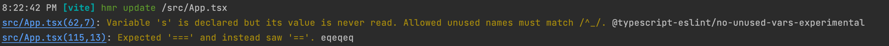

# @nabla/vite-plugin-eslint [](https://www.npmjs.com/package/@nabla/vite-plugin-eslint)

Plugs ESLint into Vite dev server.

## Differences with [vite-plugin-eslint](https://github.com/gxmari007/vite-plugin-eslint)

- Keeps HMR fast: linting is done asynchronously and doesn't block the transform process
- Reduces noise: Display results via console logs



Because of this, the plugin can't fail the build and is only applied in dev. Like typechecking, linting should be done before or in parallel of the build command.

## Install

`yarn add --dev @nabla/vite-plugin-eslint`

## Usage

```ts
import { defineConfig } from "vite";
import eslintPlugin from "@nabla/vite-plugin-eslint";

export default defineConfig({
  plugins: [eslintPlugin()],
});
```

## Options

### eslintOptions

- Type: [ESLint.Options](https://eslint.org/docs/developer-guide/nodejs-api#-new-eslintoptions)
- Default: `{ cache: true }`

Note: the `fix` option is only supported from `1.3.4`

### shouldLint

- Type: `(path: string) => boolean`
- Default: `(path) => path.match(/\/src\/[^?]*\.(vue|svelte|m?[jt]sx?)$/)`

You can use `DEBUG=eslint node_modules/.bin/vite` to debug this option (available in `1.4.0`)

### formatter

- Type: `string | ((result: ESLint.LintResult) => void)`
- Default: Custom format with one line per warning/error.

If provided, the value is passed to `eslint.loadFormatter`. Use `stylish` to get a CRA like output. Async formatters are supported in `1.5.0`. Function support was added in `2.0.2`.
